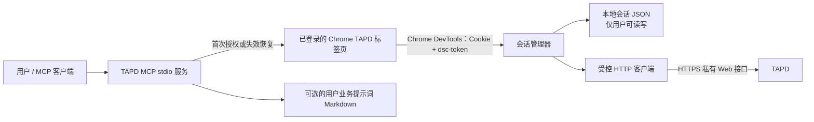

# TAPD MCP

一个面向 Codex、Claude Desktop 等 MCP 客户端的本地 TAPD 工单服务。它复用用户已登录的 Chrome TAPD Web 会话，以受控方式调用 TAPD Web 私有接口，支持需求、缺陷、图片、评论、`@mention` 与工作流流转。

> TAPD Web 接口不是公开、稳定的 API。请只在获得授权的 TAPD 账号和工作空间中使用本项目，并在 TAPD 前端升级后重新验证关键操作。

## 它解决什么问题

- 不再依赖已移除的 Codex JS REPL，也不需要把 Cookie、Token、用户名或密码交给模型。
- 首次授权或会话失效时，才从**已登录的现有 Chrome TAPD 标签页**捕获会话；其余时间直接调用 TAPD，不反复控制浏览器。
- 每个工具都强制传入 `workspace_id`，没有默认空间、没有空间白名单，也不会根据对话猜测空间。
- 写操作在提交后回读确认；网络超时或服务端异常时不自动重试，避免重复创建或错误流转。
- 需求与 Bug 正文支持 Markdown 和本地图片；Bug 创建会整理为统一的复现步骤、预期结果、实际结果与附件证据结构。
- 所有真实 `@mention` 必须先在同一空间查询成员，使用 TAPD 返回的精确 `nick`/`name`。

## 架构与数据流



Chrome 只用于会话交接：服务不会启动新的浏览器、创建额外 Profile、读取 Chrome Cookie 数据库，或把会话凭据放入 MCP 参数、响应和日志。会话 JSON 是唯一允许的本地持久化位置；收到 401、403 或登录页后会被删除，后续操作必须重新交接会话。

## 一行接入（推荐）

- Node.js 20 或更高版本
- 已安装并登录 TAPD 的 Chrome
- MCP 客户端（如 Codex）能启动本地 Node.js 进程
- 对目标 TAPD 空间有相应读写权限

无需克隆仓库、`npm install` 或全局安装。将下面一行作为 MCP 服务命令即可；`npx` 会在首次启动下载 `@zhang180031/tapd-mcp`，后续复用本机缓存。

```toml
[mcp_servers.tapd]
command = "npx"
args = ["-y", "@zhang180031/tapd-mcp"]
```

如果 MCP 客户端提供命令行添加入口，等价的服务命令是：

```bash
npx -y @zhang180031/tapd-mcp
```

包会将会话和可选业务提示词保存到当前操作系统的用户数据目录，而不是 `npx` 的临时目录或仓库：

| 系统 | 默认数据目录 |
| --- | --- |
| macOS | `~/Library/Application Support/tapd-mcp` |
| Windows | `%APPDATA%\tapd-mcp` |
| Linux | `$XDG_STATE_HOME/tapd-mcp`，未设置时为 `~/.local/state/tapd-mcp` |

其中 `session.json` 含有 TAPD Web 会话凭据，只允许当前用户读写；`prompt.md` 不存在或为空时服务仍会正常启动。**不要**把该目录同步、提交或分享给他人。

### Codex 完整示例

将以下内容写入 Codex 的 MCP 配置：

```toml
[mcp_servers.tapd]
command = "npx"
args = ["-y", "@zhang180031/tapd-mcp"]

[mcp_servers.tapd.env]
TAPD_WEB_BASE_URL = "https://www.tapd.cn"
TAPD_MAX_REQUESTS_PER_MINUTE = "60"
TAPD_REQUEST_TIMEOUT_MS = "20000"
```

首次启动后，按“首次登录与会话生命周期”完成一次已有 Chrome TAPD 标签页的会话交接。之后服务会从默认 `session.json` 自动恢复；只有 TAPD 返回认证失效时才需要重新交接。

### 从源码运行（开发者）

```bash
git clone https://github.com/zhang180031/tapd-mcp.git
cd tapd-mcp
git checkout main
git pull --ff-only
npm ci
npm run build
npm test
```

构建完成后，入口文件为 `dist/src/index.js`。项目使用 stdio 传输 MCP JSON-RPC，标准输出不会写入调试日志。

### 环境变量

可复制 [.env.example](.env.example) 作为本地参考。支持的运行参数如下：

| 变量 | 默认值 | 用途 |
| --- | --- | --- |
| `TAPD_WEB_BASE_URL` | `https://www.tapd.cn` | 固定为 TAPD HTTPS Origin；其他地址会被拒绝 |
| `TAPD_MAX_REQUESTS_PER_MINUTE` | `60` | 单个进程的请求速率上限 |
| `TAPD_REQUEST_TIMEOUT_MS` | `20000` | TAPD HTTP 请求超时，单位毫秒 |
| `TAPD_DATA_DIR` | 系统用户数据目录下的 `tapd-mcp` | 同时覆盖默认 `session.json` 与 `prompt.md` 的目录 |
| `TAPD_USER_PROMPT_PATH` | `<TAPD_DATA_DIR>/prompt.md` | 可选的、用户自行维护的业务写作规范 Markdown |
| `TAPD_SESSION_STORE_PATH` | `<TAPD_DATA_DIR>/session.json` | 本地会话 JSON 路径；内容包含敏感凭据 |
| `TAPD_CHROME_USER_DATA_DIR` | 系统 Chrome 默认目录 | 仅会话交接时用于定位 Chrome DevTools 端点 |

## 首次登录与会话生命周期

1. 在 Chrome 中打开任意已登录的 TAPD 需求或缺陷页面；若登录失效，先在该标签页完成登录。
2. 调用 `tapd_refresh_session`，并传入目标数字空间 ID 与 `action: "begin"`。
3. 再调用同一工具，传入相同空间 ID 与 `action: "complete"`。
4. 使用 `tapd_session_status` 确认状态为 `valid`。
5. 后续读写走 MCP 的直接 HTTP 客户端；Chrome 可以不再操作。

会话发生以下任一情况时，MCP 会安全失效化缓存，不会自动重放写操作：

- TAPD 返回 401 或 403；
- TAPD 返回登录页或重定向到登录页；
- 本地会话 JSON 缺失、损坏或已不可用。

此时再次执行上述会话交接流程即可。`tapd_refresh_session` 不会返回 Cookie、`dsc-token` 或查询令牌。

## 可选的业务提示词

协议、安全和字段规则内置在 MCP；**标题格式、业务模块、需求模板等业务规则不内置**。服务启动时会读取 `TAPD_USER_PROMPT_PATH`（默认是数据目录中的 `prompt.md`），并把全文作为 MCP 客户端的业务写作指导。

文件不存在、不可读或为空时，MCP 仍会启动，只是没有额外业务规范。修改后需要重启 MCP 连接。提示词文件中不得保存 Cookie、Token、密码、JWT 或其他凭据。

例如，用户可以自行要求标题统一为：

```text
【业务大模块】【最终功能页面】一句话描述
```

## 工具一览

| 范围 | 工具 | 说明 |
| --- | --- | --- |
| 会话 | `tapd_session_status` | 查询 `missing`、`waiting_for_login`、`valid`、`expired` 状态 |
| 会话 | `tapd_refresh_session` | 通过现有 Chrome 标签页开始、完成或取消会话交接 |
| 需求 | `tapd_list_stories`、`tapd_get_story`、`tapd_get_story_fields` | 列表、详情、字段和需求类别元数据 |
| 需求 | `tapd_create_story`、`tapd_update_story`、`tapd_delete_story` | 创建、Markdown/图片更新、移入回收站 |
| Bug | `tapd_list_bugs`、`tapd_get_bug`、`tapd_get_bug_fields` | 列表、详情、字段元数据 |
| Bug | `tapd_format_bug_report` | 只读预览 Bug 正文，不写入 TAPD |
| Bug | `tapd_create_bug`、`tapd_update_bug`、`tapd_delete_bug` | 创建、Markdown/图片更新、移入回收站 |
| 工作项 | `tapd_resolve_work_item_id` | 将同一空间中的短 ID 解析为完整 ID |
| 工作流 | `tapd_get_transitions` | 读取当前工作项可用的真实状态流转与必填字段 |
| 工作流 | `tapd_transition_work_item` | 流转到已明确选择的目标状态 |
| 工作流 | `tapd_advance_to_next_step` | 仅在存在唯一正常下一步时写入；否则只返回候选 |
| 成员 | `tapd_search_members` | 在指定空间搜索可用于真实提及的成员 |
| 评论 | `tapd_add_comment` | 通过 TAPD 的受控评论工作流写入评论和 `@mention` |

所有工具的实际参数 Schema 会随 MCP 初始化返回；调用前应以工具 Schema 为准。

## 使用规则与示例

以下示例中的空间 ID、工作项 ID 和类别 ID 均为演示值，不是默认配置。

### 1. 先读取需求类别

空间有多个需求类别时，创建需求前先读取字段，并从返回的 `workItemTypes` 中选择用户确认的精确 ID。服务不会凭名称猜测类型。

```json
{
  "workspace_id": "12345678"
}
```

将 `tapd_get_story_fields` 返回的 `workItemTypes[].id` 传给创建工具：

```json
{
  "workspace_id": "12345678",
  "workitem_type_id": "1234567890123456789",
  "name": "【订单管理】【订单详情】支持导出当前筛选结果",
  "description": "## 背景与目标\n\n用户需要导出当前筛选结果。\n\n## 验收标准\n\n- 当存在筛选条件时，导出内容应与当前列表一致。"
}
```

需求的 `description` 是**完整 Markdown**。更新需求时，正文是整段替换而不是局部 Patch；要保留原内容，应先调用 `tapd_get_story`。

### 2. 创建一个 Bug，并保留接口材料

`tapd_create_bug.description` 是原始事实材料，服务会生成标准 Bug 正文。若同时提供结构化的复现步骤、预期和实际结果，原始材料会置于“补充材料”章节，因此可以保留脱敏后的 curl、日志片段或接口参数。

```json
{
  "workspace_id": "12345678",
  "title": "【工单管理】【工单查询】组合筛选后服务端报错",
  "reproduction_steps": [
    "进入工单查询页面",
    "选择两个筛选条件",
    "点击搜索"
  ],
  "expected_result": "应返回同时满足筛选条件的工单数据。",
  "actual_result": "页面提示“服务器错误”，列表未返回数据。",
  "description": "请求参数与脱敏后的 curl 见此处。",
  "image_paths": ["/absolute/path/to/error.png"],
  "single_issue_confirmed": true
}
```

Bug 创建始终包含“复现步骤、预期结果、实际结果、附件证据”四个核心章节。未知核心信息由服务生成标记，调用者不要自己传入 `【待补充】` 等占位符；未提供的版本、设备、账号等补充字段则不会生成空章节。

`tapd_update_bug.fields.description` 与需求更新不同：它是**完整的最终 Markdown**，不是原始材料。更新前同样应先读取详情。

### 3. 使用真实工作流流转

不要直接通过 `fields.status` 修改状态。先读取 TAPD 当前允许的流转，再指定目标状态；只有确实唯一的正常下一步才可使用自动推进工具。

```json
{
  "workspace_id": "12345678",
  "entity_type": "bug",
  "id": "1000123"
}
```

上面的调用用于 `tapd_get_transitions`。从返回结果复制精确的 `toStatus` 和必填字段，再调用 `tapd_transition_work_item`；若要“走下一步”，调用 `tapd_advance_to_next_step`，它在存在多个候选时不会写入。

### 4. 指派与真实 `@mention`

先在同一空间调用 `tapd_search_members`，再将返回的精确候选用于指派或评论。真实提及必须同时传 `mentions` 和正文中的同一标记：

```json
{
  "workspace_id": "12345678",
  "entity_type": "bug",
  "id": "1000123",
  "comment": "请 @alice(张三) 协助确认。",
  "mentions": [{ "nick": "alice", "name": "张三" }]
}
```

普通 `@名字` 文本不会被当作真实提及。`@mention` 可能触发 TAPD 通知，不能猜测成员信息或承诺通知一定送达。

## 安全模型

- 不接受 Cookie、`dsc-token`、query token、JWT、密码或恢复令牌作为 MCP 参数或配置。
- 会话凭据只存在于内存和用户显式配置的 JSON 文件；写入使用临时文件原子替换，并在支持的平台尽力限制为当前用户权限。
- 会话 JSON、`.env`、本地日志和常见会话文件名已加入 [.gitignore](.gitignore)。提交前仍应执行一次凭据扫描。
- 需求/Bug Markdown 在写入 TAPD 前会遮蔽常见的 `Authorization`、Cookie、Bearer Token、`dsc_token`、query token 等文本模式；这是一层保护，不应替代“绝不把凭据粘贴进工单”的操作规范。
- 所有 MCP 响应和错误都会经过脱敏，错误响应只返回有限的安全诊断信息。
- 上传图片只接受 1–5 个本地绝对路径，支持 PNG/JPEG/GIF/WebP，单张最大 10 MiB；图片会上传到 TAPD 编辑器存储后以 Markdown 链接写入正文。

## 失败语义

| 错误码 | 含义与处理建议 |
| --- | --- |
| `SESSION_EXPIRED` | 会话不可用；在已登录 TAPD Chrome 标签页中重新执行会话交接 |
| `WORKSPACE_CONTEXT_REQUIRED` | 缺少空间列表上下文或字段元数据；读取字段/列表，必要时刷新该空间会话 |
| `CONTRACT_CHANGED` | TAPD 私有接口响应结构发生变化；不要猜测字段或重试写入，应先检查前端变化 |
| `WRITE_OUTCOME_UNKNOWN` | 写请求可能已到达 TAPD，但结果未确认；先查询工作项，再决定是否人工重试 |
| `AMBIGUOUS_NEXT_STEP` | 下一步候选不唯一；读取候选并由用户明确选择目标状态 |
| `INVALID_ARGUMENT` | 参数不符合 Schema、空间元数据或安全规则；修正后重新调用 |

## 项目结构

```text
src/
  index.ts                    运行时装配、会话恢复与 stdio 启动
  server.ts                   MCP 工具 Schema、协议提示词、脱敏输出边界
  application.ts              MCP facade 与服务编排
  session/                    Chrome DevTools 捕获、Cookie Jar、JSON 会话存储
  private-api/                TAPD HTTP 客户端、响应契约与安全错误模型
  services/                   需求、Bug、工作流、成员、评论、图片与 Markdown
  security/                   凭据识别、脱敏与安全输出
test/                         单元、集成和可选的真实 TAPD E2E 测试
```

其中 `PrivateHttpClient` 负责 TAPD Origin、请求速率、超时、Cookie 轮换、登录失效和写入不确定性的统一处理；业务服务只开放已经过真实接口验证的字段和流程，不为未知字段猜测请求格式。

## 开发与验证

```bash
npm run check
npm test
```

`npm test` 包含构建、单元测试和 MCP stdio 集成测试。真实 TAPD E2E 默认关闭，只有在使用隔离测试空间、有效会话并明确授权时运行：

```bash
TAPD_E2E=1 TAPD_E2E_WORKSPACE_ID=12345678 npm run test:e2e:tapd
```

真实 E2E 会创建临时工单并执行清理；不要指向生产空间或包含真实业务数据的空间。

## 发布 npm 包

发布账号需要在 npmjs.com 拥有 `@zhang180031` 作用域。包名使用 `@zhang180031/tapd-mcp`，因为无作用域的 `tapd-mcp` 已被其他发布者占用。

```bash
npm run check
npm test
npm pack --dry-run
npm publish --access public
```

发布前必须检查包内容中没有 `.env`、`session.json`、Cookie、Token、截图、日志、真实客户数据或私有接口抓包材料。`files` 白名单只发布运行所需的编译产物、README 和配置示例。

## GitHub 发布前检查

1. 确认 `git status --ignored` 中没有会话 JSON、`.env`、截图、日志或构建产物。
2. 搜索并移除 Cookie、JWT、`Authorization`、`dsc-token`、query token、账号密码以及真实客户数据。
3. 保留 `.env.example` 和 `codex.mcp.config.example.toml`，但其中只能使用占位路径。
4. 执行 `npm run check && npm test`。
5. 根据团队策略补充 `LICENSE`、`SECURITY.md` 和贡献说明；本项目不会替你选择许可证。

## 已知边界

- 本项目面向 TAPD Web 私有接口，不保证与 TAPD 官方 Open API 等价，也不承诺未来兼容。
- 当前仅开放已验证的需求/Bug 核心字段；状态必须经工作流工具变更，其他字段需完成接口契约验证后再加入。
- 默认会话会保存到用户数据目录；若禁用或删除 `session.json`，MCP 重启后需重新交接。
- Markdown 渲染器实现的是安全、有限的常用 Markdown 子集，不是通用 HTML 执行环境。
